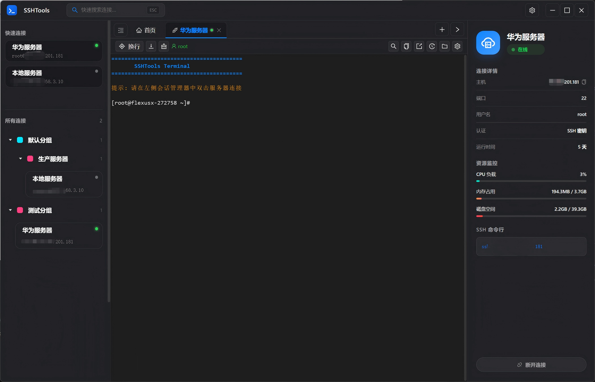
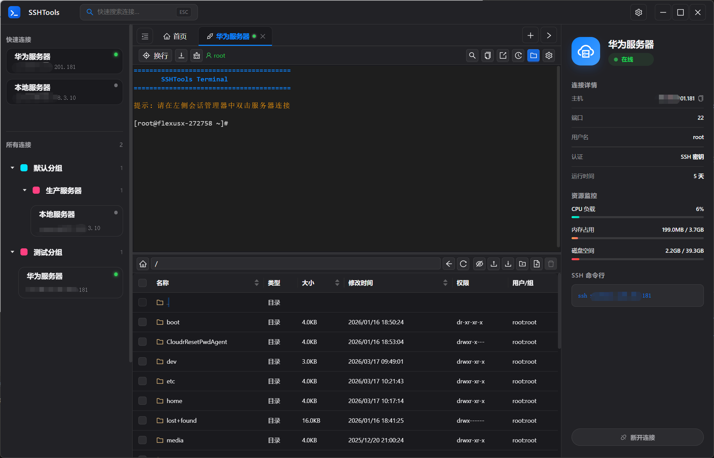
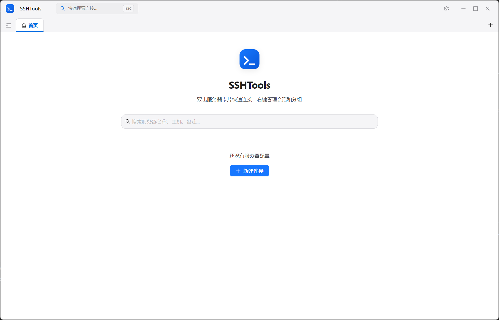
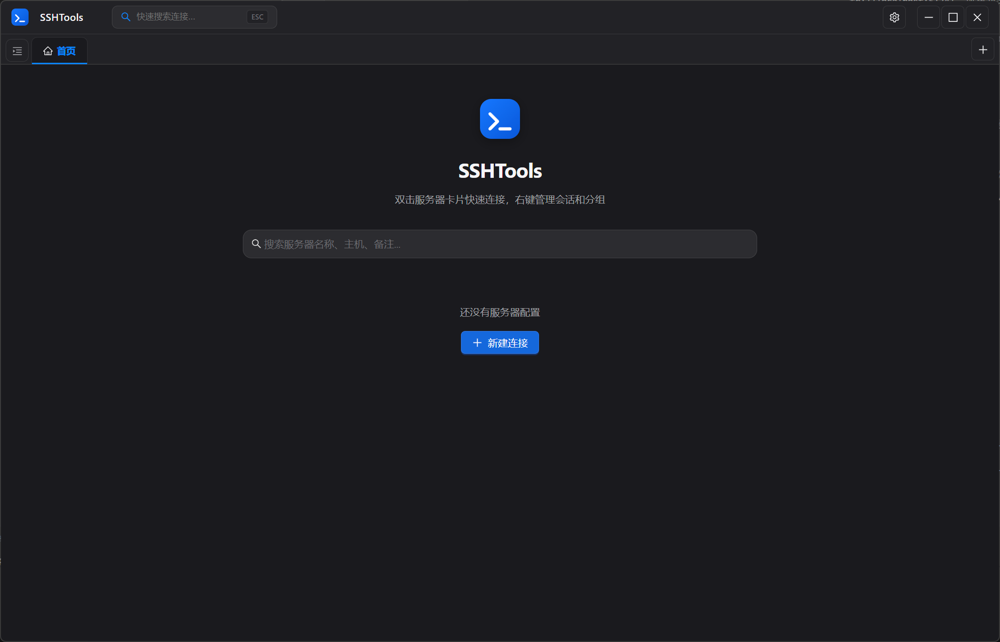

<div align="center">


# SSHTools

**开源跨平台桌面 SSH 管理工具**

基于 Electron + React + TypeScript 构建，集服务器管理、SSH 终端、SFTP 文件传输于一体。

[](LICENSE)
[](https://www.electronjs.org/)
[](https://react.dev/)
[](https://www.typescriptlang.org/)

[下载安装包](#安装) · [快速开始](#快速开始) · [功能介绍](#功能特性) · [参与贡献](#贡献)

</div>

---

## 截图预览

### SSH 终端 + 服务器管理

> 左侧树形分组管理服务器，中间 SSH 终端，右侧实时资源监控面板



### SFTP 文件管理

> 终端下方集成 SFTP 面板，支持目录浏览、文件上传下载、权限修改等操作



### 亮色 / 暗色主题

> 支持亮色、暗色、跟随系统三种主题模式，自动适配系统偏好

<p align="center">
  
  
</p>

---

## 功能特性

### SSH 终端

- 基于 **xterm.js** 的完整终端模拟器，支持 256 色和 Unicode
- **多标签页**管理，可同时连接多台服务器并自由切换
- 标签页支持**拖拽排序**，自由调整排列顺序
- 终端内 **搜索**（支持上一个 / 下一个 / 高亮匹配）
- **命令历史记录**面板，从当前会话读取历史，一键重新执行
- 选中自动复制、链接可点击跳转
- 自动换行开关、滚动锁定（查看日志时不自动滚到底部）
- 连接断开自动检测，支持一键重连
- 认证失败时弹窗输入密码重试，可选择记住密码
- 终端字号、字体、主题可按会话独立配置

### SFTP 文件管理

- 集成在终端下方，可从终端当前目录直接打开
- 完整的文件浏览器：目录导航、路径手动输入、前进后退
- 文件和目录的 **上传、下载、删除、重命名、新建**
- 重命名时自动检测同名冲突，支持确认覆盖
- **文件权限修改**（chmod），显示权限字符串和所有者信息
- 批量选择操作，支持拖拽上传（不限本地路径）
- 传输进度实时显示
- 列宽可拖拽调整，SFTP 面板高度可拖拽调整

### 服务器管理

- **树形分组**管理，支持多级嵌套子分组
- 支持 **密码** 和 **SSH 密钥** 两种认证方式
- **记住密码**可选，不记住则每次连接时输入
- 服务器配置 **复制**，快速创建相似会话
- **快速连接**列表，按最近连接时间排序
- 标题栏 **全局搜索**，按名称、主机、用户名、备注模糊匹配
- 首页服务器列表搜索和筛选
- 右键菜单：连接、编辑、复制、删除、新建会话、新建分组

### 连接监控

- 右侧详情面板实时显示 **CPU 负载、内存占用、磁盘使用率**（带进度条）
- 连接状态指示灯（绿色已连接 / 黄色连接中 / 灰色已断开）
- 显示主机、端口、用户名、认证方式、运行时间
- SSH 命令行快捷入口

### 安全设计

- 密码和私钥通过 **Electron safeStorage**（Windows DPAPI / macOS Keychain）加密存储
- localStorage 中 **不保存任何明文密码**，仅存储非敏感配置
- 配置导出使用 **PBKDF2 + AES-256-GCM** 加密所有敏感字段
- SFTP 操作内置路径注入防护（过滤空字节）
- 删除操作强制二次确认
- 应用更新时自动备份服务器配置到 electron-store

### 配置导入导出

- 点击标题栏 **设置齿轮** → **导出配置**，设置加密密码后导出 JSON 文件
- 导入时选择 JSON 文件并输入相同密码即可还原所有服务器和分组配置
- 支持导入未加密的旧版本配置文件

### 界面与交互

- 自定义无边框窗口，macOS 适配原生红绿灯按钮
- **亮色 / 暗色 / 跟随系统**三种主题模式
- 侧边栏可折叠，默认收起不占空间
- 弹窗统一使用主题感知样式，所有输入弹窗支持回车确认
- 中文界面，错误提示自动翻译为中文

---

## 技术栈

| 层级 | 技术 |
|------|------|
| 框架 | Electron 28 |
| 前端 | React 18 + TypeScript 5 |
| UI 组件 | Ant Design 5 |
| 状态管理 | Zustand（持久化 + 运行时） |
| 终端 | xterm.js 5 + 插件（fit / search / web-links） |
| SSH | ssh2 |
| 加密存储 | electron-store + Electron safeStorage |
| 构建 | Vite 5 + electron-builder |

---

## 安装

### 下载安装包

前往 [Releases](https://github.com/chepeiqing/SSHTools/releases) 页面下载对应平台的安装包：

| 平台 | 格式 |
|------|------|
| Windows | `.exe`（NSIS 安装包）/ 便携版 |
| macOS | `.dmg` / `.zip` |
| Linux | `.AppImage` / `.deb` / `.rpm` |

### 从源码构建

```bash
# 克隆仓库
git clone https://github.com/chepeiqing/SSHTools.git
cd SSHTools

# 安装依赖
npm install

# 开发运行（Vite HMR + Electron）
npm run dev

# 构建安装包
npm run build:win    # Windows
npm run build:mac    # macOS
npm run build:linux  # Linux
```

构建产物输出到 `release/` 目录。

---

## 快速开始

1. **新建会话**：点击右上角 `+` 按钮或首页"新建连接"，填写主机、端口、用户名和密码
2. **连接服务器**：双击左侧服务器卡片，或右键选择"连接"
3. **管理分组**：右键空白区域创建分组，拖拽服务器到分组中
4. **打开 SFTP**：终端工具栏点击文件夹图标，从当前目录打开文件管理器
5. **搜索服务器**：使用标题栏搜索框快速定位服务器并连接

---

## 项目结构

```
SSHTools/
├── electron/                  # Electron 主进程
│   ├── main.ts                # 窗口创建、IPC 注册、加密存储
│   ├── preload.ts             # contextBridge API 暴露
│   ├── sshManager.ts          # SSH/SFTP 连接管理（ssh2）
│   └── types.ts               # ElectronAPI 类型定义
├── src/                       # React 渲染进程
│   ├── App.tsx                # 根布局（TitleBar + SessionManager + MainContent）
│   ├── components/
│   │   ├── TitleBar/          # 标题栏（搜索、主题、导入导出、关于）
│   │   ├── SessionManager/    # 侧边栏（快速连接 + 服务器树）
│   │   ├── MainContent/       # 标签页管理 + 首页
│   │   ├── TerminalPanel/     # SSH 终端（xterm.js）
│   │   ├── SFTPPanel/         # SFTP 文件管理
│   │   ├── ServerTree/        # 服务器树形列表
│   │   └── ConnectionDetailPanel/  # 连接详情与资源监控
│   ├── stores/
│   │   ├── serverStore.ts     # 服务器配置（zustand/persist）
│   │   ├── connectionStore.ts # 运行时连接状态
│   │   └── themeStore.ts      # 主题管理
│   ├── utils/
│   │   └── crypto.ts          # AES-GCM 加解密工具
│   ├── styles/
│   │   └── global.css         # 全局样式与 CSS 变量
│   └── types/
│       └── index.ts           # 共享类型定义
├── public/                    # 静态资源（图标等）
├── build/                     # 构建资源（应用图标）
└── package.json
```

---

## 架构概览

```
┌──────────────────────────────────────────────────────┐
│                   Electron 主进程                      │
│  ┌───────────┐  ┌───────────────┐  ┌──────────────┐  │
│  │  窗口管理   │  │  SSHManager   │  │  加密凭据存储  │  │
│  └───────────┘  │  SSH 连接池     │  │  (safeStorage) │  │
│                 │  Shell 流       │  └──────────────┘  │
│                 │  SFTP 会话      │                     │
│                 └───────────────┘                      │
├─────────────── preload (contextBridge) ────────────────┤
│                   React 渲染进程                        │
│  ┌───────────┐  ┌───────────────┐  ┌──────────────┐  │
│  │  Zustand   │  │   xterm.js    │  │  Ant Design   │  │
│  │  状态管理   │  │   终端渲染     │  │  UI 组件      │  │
│  └───────────┘  └───────────────┘  └──────────────┘  │
└──────────────────────────────────────────────────────┘
```

- **主进程**：管理窗口生命周期，通过 `ssh2` 维护所有 SSH 连接池、Shell 流和 SFTP 会话，使用 `safeStorage` 加密存储凭据
- **渲染进程**：React SPA，通过 `window.electronAPI` 与主进程安全通信
- **IPC 通信**：`invoke/handle` 请求响应 + `send/on` 事件推送（SSH 数据流、传输进度、系统主题变化）

---

## 开发

```bash
# 启动开发环境（Vite HMR + Electron 热重载）
npm run dev

# TypeScript 类型检查
npx tsc --noEmit

# ESLint 代码检查
npm run lint

# 生产构建
npm run build
```

### 环境要求

- Node.js >= 18
- npm >= 9

---

## 贡献

欢迎提交 Issue 和 Pull Request！

1. Fork 本仓库
2. 创建特性分支 (`git checkout -b feature/your-feature`)
3. 提交更改 (`git commit -m 'Add your feature'`)
4. 推送到分支 (`git push origin feature/your-feature`)
5. 创建 Pull Request

---

## 联系

- **开发者**：车培清
- **邮箱**：chepeiqing@sina.com
- **仓库**：[github.com/chepeiqing/SSHTools](https://github.com/chepeiqing/SSHTools)

---

## License

[MIT](LICENSE) © 2024-2026 车培清

---

## 致谢

- [Electron](https://www.electronjs.org/) - 跨平台桌面应用框架
- [React](https://react.dev/) - 用户界面库
- [Ant Design](https://ant.design/) - 企业级 UI 组件库
- [xterm.js](https://xtermjs.org/) - 终端模拟器
- [ssh2](https://github.com/mscdex/ssh2) - SSH 协议实现
- [Zustand](https://github.com/pmndrs/zustand) - 轻量状态管理
- [Vite](https://vitejs.dev/) - 构建工具
